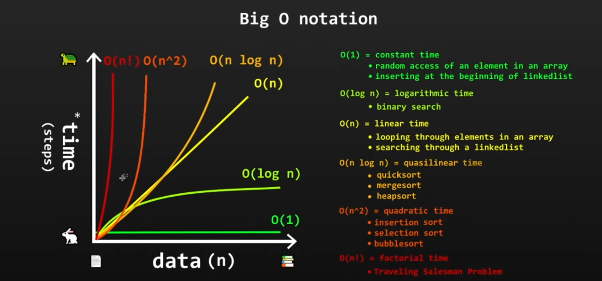

BigO - how much slower does code run as input size increases.

As your input grows, how fast does computation or memory grow.


```python
for i in range(n):
	sum += i
```

If `n` is `1000`, it takes 1000 steps to finish executing these instructions.

if `n` grows to `10000` it takes 10,000 steps, or has to iterate 10,000 times to finish.

As input size grows, time will grow as well.

so the time complexity for the above loop is `O(n)`.

`O(n)` - also called as linear time. As input size grows the time it takes will also grow linearly with respect to n.

`O(1)` - constant time

```python
arr = [1, 2, 3]
```

`print(arr[0])`, no matter how large the array is time it takes to retrieve the element is constant. Using an index.



`O(log n)` - (Google) As input grows **exponentially** (doubles), the time it takes **increases linearly** (adds 1 step). The efficiency comes from the algorithm reducing the search space by a **constant factor** (dividing by 2) at every step for binary search algorithm.

as input grows -> time it takes it takes shrinks linearly.
binary search
n = 12
n/2 = 6
n/2 * 1/2 -> n/4 = 3
n/6 = 2
... you go until there's only one box left to check
n/2^k = 1

and you apply log.. idk log

`log` is confusing...
but `O(log n)` - as input grows exponentially, time it takes grows linearly based on a factor, in terms of binary search the factor is halving the search portion by half. You don't iterate the half part you just check one pos, and for next pos check you half the part.


`O(n log n)` - time decreased when input grows, or for really large set of data.
example : quick-sort
for every loop or every time you go over an input..
you half it, but you have to loop over that half portion..
simple : you have to search n times for log n positions.. idk

`O(n^2)` - as input grows, time grows twice the input.
n=10, t=10 * 10 = 100, n = 1000, t = 1000 * 1000 -> 1,00,000

`O(n!)` - input grows, time grows factorial time n, which is really huge, and modern computers cannot perform for large input with this complexity.

#### Constants are ignored

```python
def sum_char_codes(n: str) {
    sum = 0;
    for i in range(0, len(n)):
        sum += i
	
    for i in range(0, len(n)):
        sum += i
	
    return sum;
}
```

time complexity -> `O(2N)`

from [ThePrimeagen](https://theprimeagen.github.io/fem-algos/lessons/algorithms-and-time-space-complexity/time-and-space-complexity)

1. growth is with respect to the input
2. Constants are dropped

`O(2N)` -> `O(N)` and this makes sense. That is because Big O is meant to describe the upper bound of the algorithm (the growth of the algorithm). The constant eventually becomes irrelevant.

google def : 
In Big O notation, the constant factor is "dropped" in O(2N)

==to become O(N)== because Big O notation is designed to describe the **asymptotic growth rate** of an algorithm's runtime as the input size(N) becomes arbitrarily large, not its exact execution time.

Asymptotic growth ==describes how a function's output changes as its input grows infinitely large==

Take the following :

N = 1, O(10N) = 10, O(N^2) = 1
N = 5, O(10N) = 50, O(N^2) = 25
N = 100, O(10N) = 1,000, O(N^2) = 10,000 // 10x bigger
N = 1000, O(10N) = 10,000, O(N^2) = 1,000,000 // 100x bigger
N = 10000, O(10N) = 100,000, O(N^2) = 100,000,000 // 1000x bigger

look [here](https://theprimeagen.github.io/fem-algos/lessons/algorithms-and-time-space-complexity/time-and-space-complexity)

Imp

growth is with respect to input
constants are dropped
worst case is usually considered

some times `O(n^2)` is better than `O(n)` for smaller inputs, choose algorithms that best suite a better solution.

## Space Complexity

It's similar to time complexity
to solve a problem, you have an input..
and you have an algorithm that goes over that input but requires additional space to solve it..
the amount of space required can also be denoted by `O(N)`, N being the space required.
as input size grow, how much additional space do we need to deal with input data.

example algorithm could be:
for `O(N)` -> time we need `O(N)` space to solve some problem.

Just watch [this](https://www.youtube.com/watch?v=itn09C2ZB9Y) for `O(n)` and `O(n^2)` and space complexity. Figure out `log`
